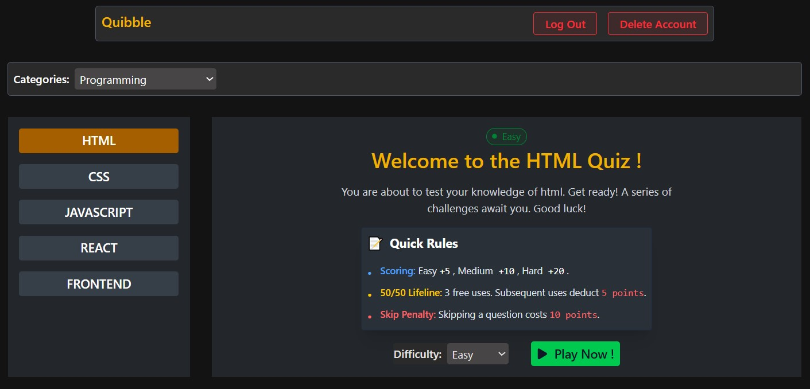

# Quibble – Interactive Quiz App

## 🛠️ Tech Stack

| Category       | Technologies Used                          |
|----------------|--------------------------------------------|
| **Frontend**   | React.js, Tailwind CSS, JavaScript/JSX     |
| **Build Tool** | Vite / Create React App                    |
| **Design**     | Figma (for prototyping & UI design)        |
| **Deployment** | Netlify / Vercel / GitHub Pages            |
| **Other**      | React Router, React Icons, SEO meta tags   |

---

> 🧠 *Test your knowledge with categorized quizzes, lifelines & real-time scoring!*

**Description**: A feature-rich quiz application with categories, difficulty levels, authentication, and gamified elements.

**Features**:
- 📚 Categorized quizzes with subcategories
- 🎯 Difficulty levels: Easy, Medium, Hard
- 💡 50/50 Lifeline & skip penalties
- 🔐 Complete Authentication System
- 📊 Interactive Result Board
- ⏱️ Real-time scoring and timer

**Tech Stack**: React, JavaScript, Tailwind CSS, Figma

🔗 [Live Demo](https://heycoderji-quibble.netlify.app/)

---
